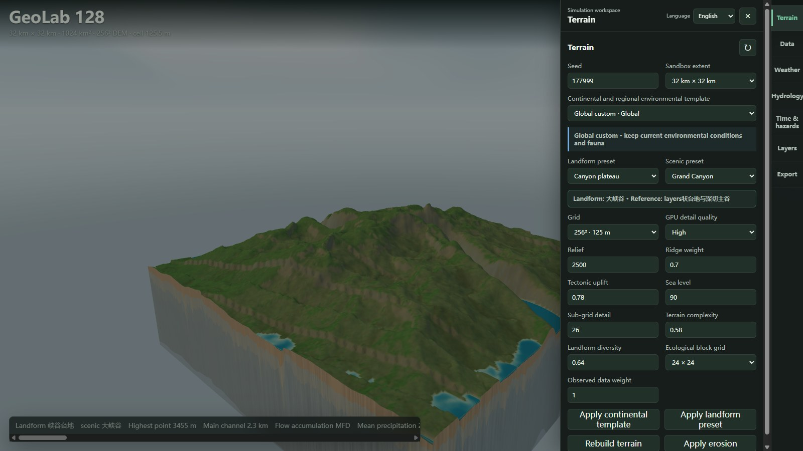
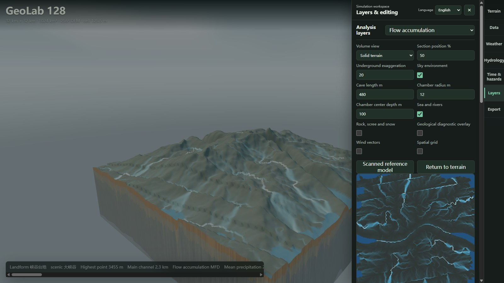

# GeoLab 128

[](https://github.com/laiyukai910-star/geolab-128/actions/workflows/ci.yml)
[](LICENSE)
[](https://github.com/laiyukai910-star/geolab-128/releases)



GeoLab 128 is a local 3D application for constructing regional landscape scenarios and examining
how terrain, weather, water, geology, habitat, wildlife and facilities interact. You can edit a
scenario, inspect its calculated layers and 3D representation, then export the data for further
work. It is a teaching and exploratory prototype, not a calibrated prediction service.

The desktop application uses a loopback-only native service. The browser version runs model
calculations locally through its bundled WebAssembly worker; the hosted copy must first load its
application files from GitHub Pages.

## Contents

- [Features](#features)
- [Feature Gallery](#feature-gallery)
- [Example Workflow](#example-workflow)
- [Architecture](#architecture)
- [Getting Started](#getting-started)
- [Scientific Scope](#scientific-scope)
- [Repository Map](#repository-map)

## Features

| Area | Controls and inputs | Inspectable results |
| --- | --- | --- |
| Region and terrain | Choose a 4-512 km square extent, 128²-4096² grid, seed, continental template or landform preset; adjust relief, uplift, sea level and terrain complexity. Import DEMs as GeoTIFF, CSV, JSON or GeoJSON. | 3D surface, elevation, slope, curvature, roughness, terrain sections and a solid-volume view. The default 128 km / 256² setup has about 502 m between grid samples; a larger grid does not create measured detail absent from the input. |
| Climate | Set temperature, precipitation, humidity, wind and related conditions, or import meteorological fields. | Temperature, precipitation, wind, evapotranspiration and water-balance layers. |
| Rivers and watersheds | Adjust channel-formation threshold and hydrological parameters; import flow lines, soil data and bathymetry. | Flow accumulation and routing, watershed delineation, runoff, discharge, channel geometry, erosion and deposition diagnostics. |
| Ground and groundwater | Set underground depth and section position; import lithology and groundwater-depth evidence. | Geological sections, modelled strata, lithology, aquifer potential, stress, confidence and subsurface data exports. Cave geometry is a visual scenario, not a solved cave-flow model. |
| Land cover and ecology | Edit surface patches and vegetation conditions; examine ecological blocks, barriers and habitat settings. | Cover, canopy, leaf area, biomass, habitat suitability and connectivity views. |
| Wildlife and aquatic habitat | Configure species and releases; inspect freshwater and marine habitat separately. | Distribution and movement indicators, habitat classifications and illustrative organism models. These are not field-validated population forecasts. |
| Facilities | Select an area before placing a facility; choose from housing, transport, civic, industry, energy, water and emergency types. Search, focus, edit or remove individual placements. | Suitability screening, placed footprints, impervious cover, demand and risk indicators; procedural 3D models for supported facility types. |
| Time and hazards | Set a simulation time and examine hazard scenarios. | Flood, drought, wildfire and landslide screening, time-series output and hazard-event export. |
| Evidence and export | Import supported rasters/vectors; save parameters and reports. | Scenario and quality reports, CSV/JSON/GeoJSON layers, and Unity Terrain / Unreal Landscape interchange packages. Exports are terrain interchange data, not complete engine scenes. |

The 3D scene and analytical maps share scenario inputs, but some scene detail is illustrative or
render-only. Imported observations, inferred fields and display geometry should not be treated as
equivalent evidence.

## Feature Gallery

These screenshots were captured from the browser application at 32 km × 32 km with a 256² grid,
using the Grand Canyon scenic preset. They show the current renderer and interface without
retouching; the preset is an illustrative terrain scenario, not a reconstruction from surveyed
Grand Canyon data.

The opening image shows the terrain controls and 3D scene. The second image shows the same
scenario with flow accumulation selected:



## Example Workflow

1. In **Terrain**, choose an extent and grid. Apply a continental or landform preset, or import a DEM in **Data**.
2. In **Weather** and **Hydrology**, change precipitation, wind, soil behaviour and channel threshold; rebuild or run the model.
3. In **Layers**, compare elevation, flow accumulation, flood screening, land cover and subsurface views. Open a section or volume view to inspect the vertical representation.
4. In **Data**, select an area and add facilities. Check the placement list and suitability output before keeping or editing each feature.
5. In **Export**, save the scenario, selected grid/vector layers and quality reports. Treat reports as model diagnostics, not as field validation.

## Architecture

```text
scenario controls and imported evidence
              |
   terrain and climate
              |
   routing, water and sediment
              |
   subsurface and ecology
              |
   wildlife and infrastructure
              |
   checks, analytical views and exports
```

`engine/geolab-core` holds the typed Rust calculations shared by the native service and the
WebAssembly worker. The browser owns interaction and rendering; a compatible working layer can be
replaced atomically by a validated Rust result, and a failed process gate leaves the existing
scenario state intact.

Water-connected habitat classification, including boundary-connected seawater and river-node
detection, runs as a Rust raster kernel up to 4096 × 4096 cells, reading binary elevation and
river arrays inside the model worker. TypeScript defines the habitat contracts and supplies a
diagnosed fallback when the kernel is unavailable.

Terrain surface, solid volume, geological sections and caves reuse modelled lithology and
landform data where available. Materials and object geometry also contain procedural display
choices; they are not measurements of real rock faces, cave passages or buildings.

## Getting Started

**Try it without installing anything:** <https://laiyukai910-star.github.io/geolab-128/>

The hosted browser build is published by [`.github/workflows/pages.yml`](.github/workflows/pages.yml).
It loads application files from GitHub Pages, then runs model calculations in the browser. The
desktop path adds the local Rust service.

### Desktop

```powershell
cd outputs/geo-sim-desktop
npm ci
npm start
```

The desktop runtime starts the loopback-only Rust service and the Electron workspace.

### Browser

```powershell
cd outputs/geo-sim
python -m http.server 4174 --bind 127.0.0.1
```

Open <http://127.0.0.1:4174/>. Static mode uses the bundled WebAssembly worker. The interface
defaults to English and includes Simplified Chinese.

### Verification

```powershell
cargo test --manifest-path engine/Cargo.toml --workspace
node outputs/geo-sim/tests/<name>.test.mjs
npm run typecheck --prefix outputs/geo-sim-desktop
```

The test suite is deterministic and runs without a browser. CI runs the Rust workspace, the
TypeScript type check, the JavaScript syntax check, every model test and every entry-point
assertion on each push to `main`.

## Scientific Scope

GeoLab makes its assumptions visible and keeps imported evidence distinct from modelled fields.
Its structure draws on established hydrology, geomorphology, groundwater, rock mechanics and
connectivity formulations, including FAO-56 reference evapotranspiration, NRCS runoff
constraints, multiple-flow-direction routing, Manning normal-depth inversion for finite-width
channels, groundwater-reservoir concepts, RUSLE-structured erosion accounting, Selby-style
rock-mass strength classification, joint-spacing and bed-thickness relations, and
resistance-based landscape connectivity.

The lithology class set is checked against the Global Lithological Map (GLiM v1.1). The repository
does not currently consume a global measured weathered-cover thickness grid.

It is **not** a calibrated forecast, a hydraulic CFD model, a geological survey, a
species-distribution model, or an engineering approval tool. Procedural terrain, organisms,
caves and materials are visual representations; cave geometry does not modify groundwater
conductance or storage. Real-world decisions require quality-controlled inputs, a
scale-appropriate model, calibration and validation data, uncertainty analysis, and domain
review.

Detailed method boundaries and checked behaviour:

- [Terrain materials](docs/v1-readiness/TERRAIN_MATERIALS.md)
- [Terrain, water and underground views](docs/v1-readiness/WORLD_VOLUME.md)
- [Organisms, aquatic habitat and cave controls](docs/v1-readiness/BIOMES_AND_CAVES.md)
- [River reconstruction](docs/v1-readiness/RIVER_RECONSTRUCTION.md)
- [Asset construction notes](docs/v1-readiness/ASSET_REBUILD.md)

## Repository Map

| Path | Contents |
| --- | --- |
| `engine/geolab-core/` | Shared Rust model library |
| `engine/geolab-server/` | Loopback-only native service |
| `engine/geolab-wasm/` | WebAssembly interface |
| `outputs/geo-sim/` | Browser workspace, renderer, adapters and exports |
| `outputs/geo-sim/src-ts/` | TypeScript computation and transport boundaries |
| `outputs/geo-sim-desktop/` | Electron runtime and local build orchestration |
| `outputs/geo-sim/tests/` | Deterministic model, renderer, geology and interoperability tests |
| `media/` | Documentation images |

See [CONTRIBUTING.md](CONTRIBUTING.md) for contribution guidance, [CHANGELOG.md](CHANGELOG.md)
for release history, and [LICENSE](LICENSE) for licensing.
