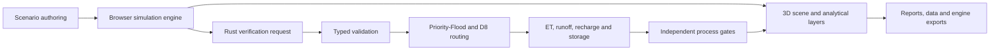

# GeoLab 128


> Build a regional scenario, change its terrain and boundary conditions, and trace the consequences through water, ecosystems, the subsurface, infrastructure, and a live 3D scene.

[](https://github.com/laiyukai910-star/geolab-128/actions/workflows/ci.yml)
[](LICENSE)
[](https://github.com/laiyukai910-star/geolab-128/tags)

GeoLab 128 is an interactive geographic systems laboratory for exploring how a region behaves as a connected whole. Raise a ridge and the wind exposure changes. Change rainfall or vegetation and the water partition shifts. Add roads, housing, reservoirs, or utilities and the model updates runoff, heat, habitat, service demand, and local suitability together.

The application combines a fast browser simulation engine with an independent Rust computation core. The browser engine supports the full authoring and 3D workflow; the Rust core re-runs a bounded terrain and hydroclimate model with typed inputs, strict validation, deterministic routing, and its own conservation gates.

## What You Can Explore

| Workspace | What changes together |
| --- | --- |
| Terrain and landforms | Continental templates, ridges, basins, valleys, local terrain editing, elevation up to 10,000 m, slope, aspect, exposure, roughness, and drainage structure. |
| Climate and wind | Temperature, humidity, latitude, lapse rate, wind speed and direction, terrain exposure, rain shadow, precipitation response, and reference evapotranspiration. |
| Water and geomorphology | Priority-Flood depression handling, D8/MFD/D∞ routing, runoff, recharge, soil storage, discharge, river extraction, stream power, erosion, deposition, and screening-level hazards. |
| Ecology and wildlife | Climate-consistent habitat blocks, functional connectivity, carrying capacity, trophic support, biodiversity diagnostics, migration links, and screened batch releases. |
| Subsurface | Layered geology, soil columns, groundwater state, aquifer potential, transects, solid volumes, and exportable voxel/cube ledgers. |
| Built environment | Select an area, place infrastructure, and let suitability, terrain, water, vegetation, service demand, impervious cover, retention, and neighboring blocks constrain the result. |
| Time and hazards | Multi-year vegetation and water response, seasonal state, drought, flood, wildfire, slope instability, compound events, recovery, and resilience summaries. |
| Evidence and exports | DEM, land cover, soils, weather, flowlines, facilities, boreholes, calibration inputs, provenance audits, uncertainty reports, GeoJSON/CSV, and engine-ready terrain packages. |

Study areas range from 4 km to 512 km per side. Interactive terrain options extend to 4096 × 4096 samples, while local refinement, ecological blocks, networks, footprints, transects, subsurface solids, and agents provide additional representations where one raster is not enough.

## A Coupled Scenario

1. Choose an extent, terrain form, climate boundary, soil behavior, and time horizon.
2. Edit the surface or select an area for infrastructure and ecological intervention.
3. Run the model to resolve wind exposure, water partitioning, flow paths, erosion pressure, habitat state, subsurface response, and facility feedback.
4. Inspect the same state as a 3D landscape, analysis layer, cell record, ecological network, cross-section, volume ledger, or scenario synthesis.
5. Run the Rust verification kernel and export both the result and the assumptions that produced it.

The aim is not a single opaque score. GeoLab keeps weak links visible through separate process gates, coupling scores, evidence coverage, source records, and uncertainty notes.

## Two Computation Cores



The Rust workspace provides:

- a typed scenario contract with finite-value, range, unit, shape, and request-size validation;
- separate point spacing and cell support area, preventing resolution-dependent area inflation;
- Priority-Flood depression resolution, Horn slope, acyclic D8 receivers, and topological contributing-area/discharge accumulation;
- FAO-56 Penman-Monteith structured reference ET and an NRCS curve-number event-response constraint;
- explicit annual allocation across demand, actual ET, runoff, groundwater recharge, soil-storage change, and unresolved residual;
- independent gates for water closure, depression resolution, ET bounds, downslope routing, accumulation continuity, and finite numerics;
- a loopback-only Axum API with bounded payloads, bounded concurrency, execution timeout, versioned endpoints, and deterministic reports.

The desktop application starts and stops this service automatically. Static-browser mode remains available without it.

## 3D And Engine Workflows

The Three.js scene visualizes terrain, river networks, vegetation, infrastructure, wildlife, ecological blocks, wind, and subsurface cutaways. It is a working analysis view: layer changes, selected regions, simulation time, and modeled interventions update the scene rather than living in a separate preview.

The export drawer creates self-contained packages for production engines:

| Target | Terrain data | Additional context |
| --- | --- | --- |
| Unity Terrain | Little-endian 16-bit RAW at supported `2^n+1` resolutions | TGA surface masks, ENU vectors, terrain origin and size, elevation mapping, provenance, and physical-gate report. |
| Unreal Landscape | Little-endian 16-bit R16 at recommended Landscape dimensions | R8 weight layers, RAW sidecar, calculated XY/Z scale, actor elevation, ENU vectors, provenance, and physical-gate report. |

These are transparent interchange assets, not prebuilt game levels. Their manifests state axis mapping, row order, units, local extent, geographic anchor, and unresolved production responsibilities.

## Quick Start

### Desktop application

Install current Node.js, npm, and the pinned Rust toolchain, then run:

```powershell
cd outputs/geo-sim-desktop
npm ci
npm start
```

`npm start` builds the Rust service and launches Electron. The application itself, computation service, Three.js runtime, and GeoTIFF reader remain local.

### Static browser mode

```powershell
cd outputs/geo-sim
python -m http.server 4174
```

Open <http://127.0.0.1:4174/>. The interface defaults to English and includes a Simplified Chinese switch.

### Rust service

```powershell
cargo run --release --manifest-path engine/Cargo.toml --package geolab-server -- --port 48129
```

The local API exposes:

| Endpoint | Purpose |
| --- | --- |
| `GET /health` | Runtime and API-version readiness. |
| `GET /v1/capabilities` | Grid limits, processes, routing mode, and output layers. |
| `POST /v1/validate` | Validate a typed scenario without running it. |
| `POST /v1/simulate` | Run terrain, routing, water partitioning, and process gates. |

Append `?backend=http://127.0.0.1:48129` to the static application URL to attach a manually started service. The complete contract is documented in [engine/README.md](engine/README.md).

## Method And Validation Boundary

Model structure is informed by [FAO Irrigation and Drainage Paper 56](https://www.fao.org/4/X0490E/x0490e00.htm), the [USDA NRCS direct-runoff handbook](https://directives.nrcs.usda.gov/sites/default/files2/1754923466/Subpart%20H%20%E2%80%93%20Estimation%20of%20Direct%20Runoff%20from%20Storm%20Rainfall.pdf), [UNCCD aridity definitions](https://www.unccd.int/sites/default/files/sessions/documents/ICCD_CRIC6_3_Add.1/3add1eng.pdf), and [USGS stream-power guidance](https://pubs.usgs.gov/publication/sir20235145/full). Engine exports follow [Unity Terrain heightmap constraints](https://docs.unity3d.com/6000.0/Documentation/ScriptReference/TerrainData-heightmapResolution.html) and [Unreal Landscape technical guidance](https://dev.epicgames.com/documentation/unreal-engine/landscape-technical-guide-in-unreal-engine?lang=en-US).

GeoLab 128 is a teaching and exploratory prototype under active validation development. It is not a calibrated weather, flood, groundwater, erosion, ecosystem, or engineering forecast. Procedural terrain is not surveyed terrain; derived meteorological forcing is not station data; D8/MFD/D∞ routing is not a two-dimensional hydraulic solver. Use quality-controlled inputs, calibration, uncertainty analysis, and qualified domain review before applying any workflow to a real decision.

## Repository

| Path | Role |
| --- | --- |
| `engine/geolab-core/` | Rust terrain, hydroclimate, routing, conservation, and gate library. |
| `engine/geolab-server/` | Bounded local Axum service used by the desktop application. |
| `outputs/geo-sim/` | Browser application, JavaScript simulation engine, Three.js renderer, adapters, and exports. |
| `outputs/geo-sim-desktop/` | Electron runtime, Rust sidecar lifecycle, and local packaging. |
| `outputs/geo-sim/tests/` | Deterministic client, model, ecology, reporting, and interchange tests. |
| `.github/workflows/ci.yml` | Rust and JavaScript integrity pipeline. |

Contributions are welcome through [CONTRIBUTING.md](CONTRIBUTING.md). Release history is maintained in the single root [CHANGELOG.md](CHANGELOG.md). GeoLab 128 is available under the [MIT License](LICENSE).
