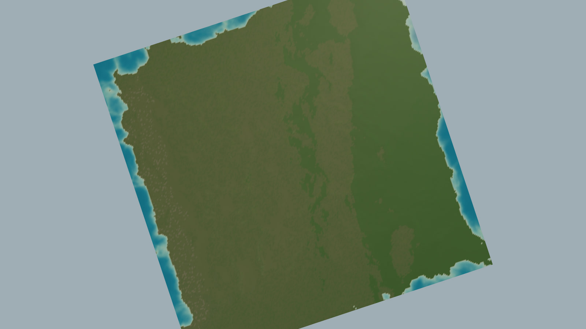
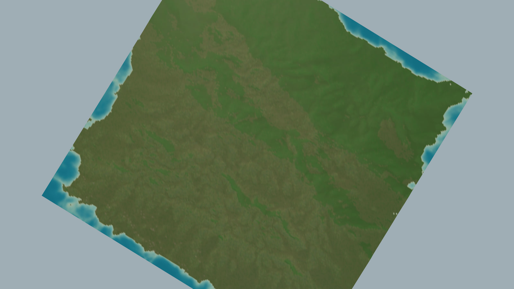
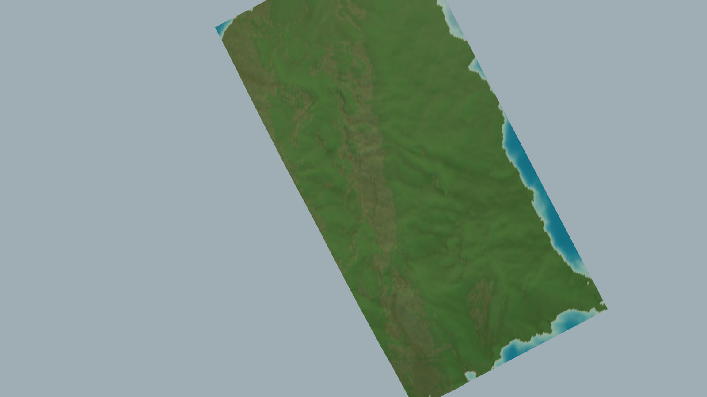
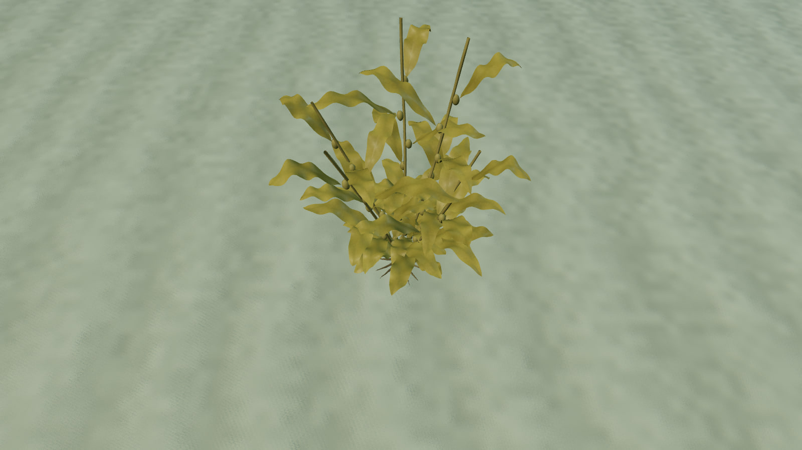
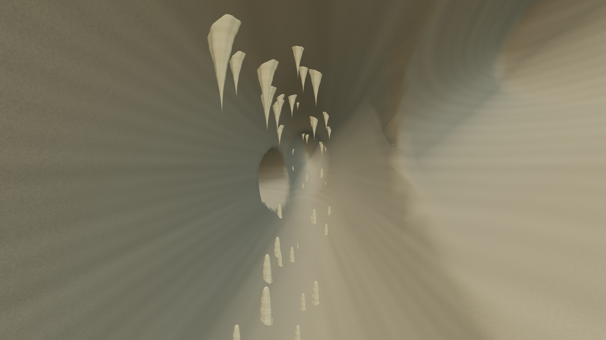
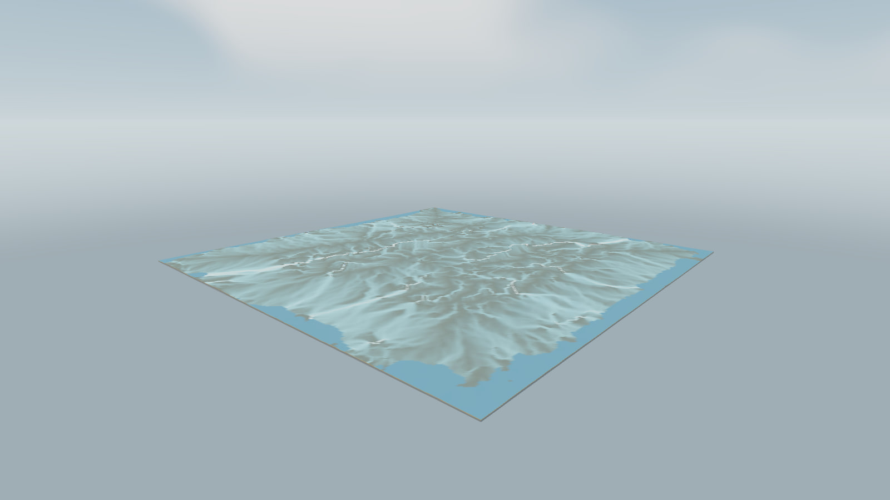
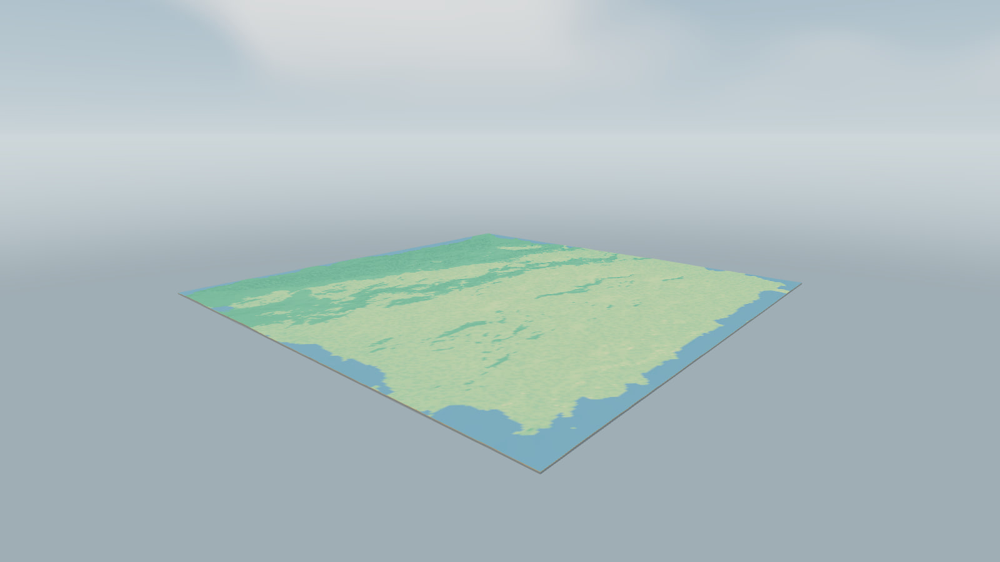
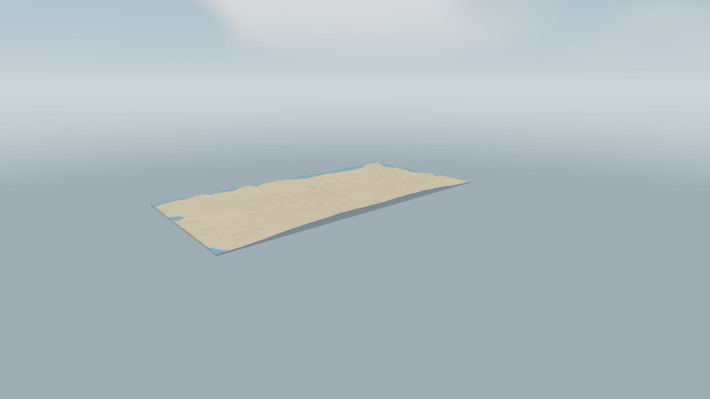

# GeoLab 128

[](https://github.com/laiyukai910-star/geolab-128/actions/workflows/ci.yml)
[](LICENSE)
[](https://github.com/laiyukai910-star/geolab-128/releases)



GeoLab 128 is a local-first 3D workspace for building and inspecting regional geographic
scenarios. Terrain, climate, surface water, groundwater, subsurface structure, ecology, wildlife
and infrastructure are held in one model that stays inspectable end to end: every analytical
layer, cutaway, render and export reads the same scenario state, and nothing is computed for
display alone.

The workspace runs entirely on the local machine. The native service binds to loopback only, the
browser build ships its own WebAssembly worker, and the renderer uses bundled assets with no
network dependency at runtime.

## Contents

- [What It Does](#what-it-does)
- [Feature Gallery](#feature-gallery)
- [Workspace Layers](#workspace-layers)
- [Analytical Views](#analytical-views)
- [Architecture](#architecture)
- [Getting Started](#getting-started)
- [Scientific Scope](#scientific-scope)
- [Repository Map](#repository-map)

## What It Does

**Build a region.** Start from a continental template, shape relief with elevation controls, or
import your own raster evidence — a DEM as GeoTIFF, CSV, JSON or GeoJSON, together with soil
hydrology, land cover, meteorological and subsurface observations. Regional grids run from
128 × 128 to 4096 × 4096 samples across study areas from 4 km to 512 km, with elevation controls
up to 10,000 m. Imported evidence stays distinct from modelled fields and is carried through to
export with its provenance and coverage.

**Trace the consequences.** Change relief, sea level, temperature, precipitation, wind, soil
behaviour or land cover, and follow the effect through flow routing, runoff, recharge, discharge
and sediment transport, then on into habitat suitability, ecological connectivity, carrying
capacity and infrastructure demand.

**Inspect it from any angle.** View the terrain as a natural landscape, a closed solid block with
modelled strata, a geological section, an underwater scene, or an adjustable karst cave. Screen
the subsurface by lithology, aquifer potential, stress and confidence; screen freshwater and
marine habitat separately; and inspect procedural anatomy for the modelled organisms at close
range.

**Take the result with you.** Export terrain interchange packages for Unity Terrain and Unreal
Landscape alongside GeoTIFF, CSV, JSON and GeoJSON layers, scenario files, and per-domain reports
that record which inputs were observed, which were modelled, and where the inference is weak.

## Feature Gallery

### Natural landscape

The terrain surface is generated, not textured: relief, slope, aspect, roughness and curvature
drive a procedural surface carrying rock joints, bedding, soil aggregates, mineral grain and
vegetation mottling. Rock exposure and weathered cover are derived from the underlying lithology
and its geomorphology rather than from a single slope curve, so bare rock, scree, soil and
vegetation are apportioned by process.



### Solid volume and strata

The terrain closes into a displayable solid with elevation-following sides, modelled underground
layers and a base. Subsurface tones come from the lithology reference table, and lamination is
drawn at the modelled bed thickness, so a thinly interbedded sequence reads as laminae and a
thick unit as massive beds.



### Underwater

Sea surfaces reuse the terrain geometry, so shorelines follow the same heightfield as the ground.
Seabed grain, surface ripples, depth-dependent water colour and fog provide depth cues, and
entering or leaving the water swaps the optical environment automatically.



### Karst cave

The cave scenario builds a closed passage network anchored to real bedding contacts: one conduit
per soluble host bed at that bed's own contact depth, a vadose shaft from the top contact and a
phreatic outlet along the base of the host, with conduit reach scaling with the host's joint
spacing. It is illustrative geometry — it infers no cave from observations and changes no
groundwater calculation.



### Analytical layers

Thirty-six analytical views read the same scenario state as the landscape render. Flow
accumulation, discharge, shear stress, erosion and deposition describe the water and sediment
system; temperature, precipitation, evapotranspiration and water balance describe the climate;
subsurface, aquifer, geostress and confidence describe the ground; vegetation, canopy, leaf area
and biomass describe the cover; connectivity and wildlife describe the ecology.







## Workspace Layers

| Layer | Inputs | Diagnostic outputs |
| --- | --- | --- |
| Terrain and climate | Continental template, DEM import, elevation, sea level, temperature, humidity, precipitation, wind | Elevation, slope, aspect, roughness, exposure, climate fields, reference evapotranspiration |
| Water and landform | Soil behaviour, flow routing, retention, erosion, sediment | Flow paths, watersheds, runoff, recharge, discharge, channel width and depth, shear stress, erosion and deposition |
| Underground and coast | Layer depth, geological evidence, section position, cave dimensions | Columns, lithology and material classes, groundwater indicators, cutaways, seabed, sea surface |
| Ecology and wildlife | Vegetation, block size, barriers, species, releases | Habitat, resistance, connectivity, carrying capacity, movement links |
| Built environment | Placement areas, facility type, density, demand, adaptation | Suitability, footprints, impervious cover, water demand, heat and risk indicators |
| Evidence and export | GeoTIFF, CSV, JSON, GeoJSON, scenario files | Provenance, coverage, quality reports, Unity and Unreal terrain packages |

## Analytical Views

**Terrain and climate** — elevation, slope, curvature, topographic position, roughness,
temperature, precipitation, evapotranspiration, water balance, wind.

**Water and sediment** — flow accumulation, flow velocity, shear stress, discharge, runoff,
wetness, infiltration, soil water, sediment transport, erosion, deposition.

**Hazards** — flood, drought, wildfire and landslide screening, with a physical-time axis and
hazard event export.

**Underground** — subsurface lithology, aquifer potential, geostress, confidence, underground
risk, root depth.

**Ecology** — vegetation cover, type, canopy, leaf area index and biomass; landscape
connectivity; wildlife distribution, movement and migration corridors.

**Built environment** — land cover, impervious cover, built damage and resilience, plus
procedural geometry for 21 facility kinds spanning buildings, industry, water and power,
transport and civic works.

## Architecture

```text
scenario controls and imported evidence
              |
   terrain and climate
              |
   routing, water and sediment
              |
   subsurface and ecology
              |
   wildlife and infrastructure
              |
   checks, analytical views and exports
```

`engine/geolab-core` holds the typed Rust calculations shared by the native service and the
WebAssembly worker. The browser owns interaction and rendering; a compatible working layer can be
replaced atomically by a validated Rust result, and a failed process gate leaves the existing
scenario state intact.

Water-connected habitat classification, including boundary-connected seawater and river-node
detection, runs as a Rust raster kernel up to 4096 × 4096 cells, reading binary elevation and
river arrays inside the model worker. TypeScript defines the habitat contracts and supplies a
diagnosed fallback when the kernel is unavailable.

Display layers are derived rather than authored twice. Lithology petrophysics, rock-mass
strength, joint spacing, weathered-cover thickness and landform class all come from one reference
table and one derivation module, which the terrain surface, the solid volume, the geological
section and the cave all read. Every relationship carries its source, and every constant chosen
by the author is marked as calibrated, so the two cannot be confused.

## Getting Started

**Try it without installing anything:** <https://laiyukai910-star.github.io/geolab-128/>

That hosted copy is the same browser build described below, published by
[`.github/workflows/pages.yml`](.github/workflows/pages.yml) with the Rust WebAssembly core
compiled from source. It makes no network requests at runtime, so it behaves exactly like the
local one. Running locally remains the primary path: it keeps your scenarios on your own machine
and adds the native Rust service.

### Desktop

```powershell
cd outputs/geo-sim-desktop
npm ci
npm start
```

The desktop runtime starts the loopback-only Rust service and the Electron workspace.

### Browser

```powershell
cd outputs/geo-sim
python -m http.server 4174 --bind 127.0.0.1
```

Open <http://127.0.0.1:4174/>. Static mode uses the bundled WebAssembly worker. The interface
defaults to English and includes Simplified Chinese.

### Verification

```powershell
cargo test --manifest-path engine/Cargo.toml --workspace
node outputs/geo-sim/tests/<name>.test.mjs
npm run typecheck --prefix outputs/geo-sim-desktop
```

The test suite is deterministic and runs without a browser. CI runs the Rust workspace, the
TypeScript type check, the JavaScript syntax check, every model test and every entry-point
assertion on each push to `main`.

## Scientific Scope

GeoLab makes its assumptions visible and keeps imported evidence distinct from modelled fields.
Its structure draws on established hydrology, geomorphology, groundwater, rock mechanics and
connectivity formulations, including FAO-56 reference evapotranspiration, NRCS runoff
constraints, multiple-flow-direction routing, Manning normal-depth inversion for finite-width
channels, groundwater-reservoir concepts, RUSLE-structured erosion accounting, Selby-style
rock-mass strength classification, joint-spacing and bed-thickness relations, and
resistance-based landscape connectivity.

The lithology class set is checked against the Global Lithological Map (GLiM v1.1). The remaining
ground-truth target for the weathered-cover derivation is the published global thickness of soil,
regolith and sedimentary deposits; the repository does not yet consume that grid and says so
where the derivation is defined.

It is **not** a calibrated forecast, a hydraulic CFD model, a geological survey, a
species-distribution model, or an engineering approval tool. Procedural terrain, organisms,
caves and materials are visual representations; cave geometry does not modify groundwater
conductance or storage. Real-world decisions require quality-controlled inputs, a
scale-appropriate model, calibration and validation data, uncertainty analysis, and domain
review.

Detailed method boundaries and checked behaviour:

- [Terrain materials](docs/v1-readiness/TERRAIN_MATERIALS.md)
- [Terrain, water and underground views](docs/v1-readiness/WORLD_VOLUME.md)
- [Organisms, aquatic habitat and cave controls](docs/v1-readiness/BIOMES_AND_CAVES.md)
- [River reconstruction](docs/v1-readiness/RIVER_RECONSTRUCTION.md)
- [Asset construction notes](docs/v1-readiness/ASSET_REBUILD.md)

## Repository Map

| Path | Contents |
| --- | --- |
| `engine/geolab-core/` | Shared Rust model library |
| `engine/geolab-server/` | Loopback-only native service |
| `engine/geolab-wasm/` | WebAssembly interface |
| `outputs/geo-sim/` | Browser workspace, renderer, adapters and exports |
| `outputs/geo-sim/src-ts/` | TypeScript computation and transport boundaries |
| `outputs/geo-sim-desktop/` | Electron runtime and local build orchestration |
| `outputs/geo-sim/tests/` | Deterministic model, renderer, geology and interoperability tests |
| `media/` | Documentation images |

See [CONTRIBUTING.md](CONTRIBUTING.md) for contribution guidance, [CHANGELOG.md](CHANGELOG.md)
for release history, and [LICENSE](LICENSE) for licensing.
