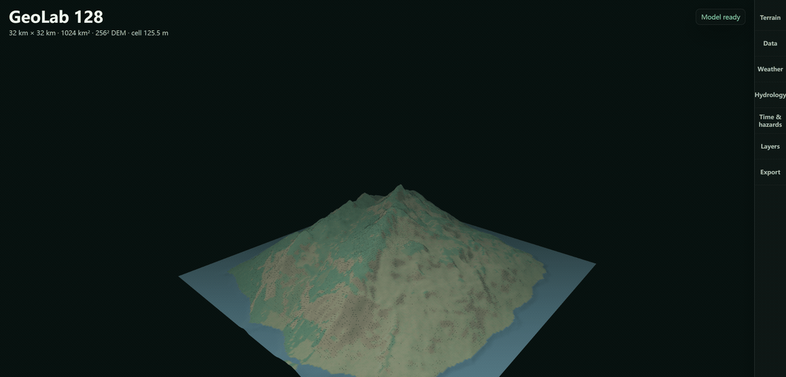
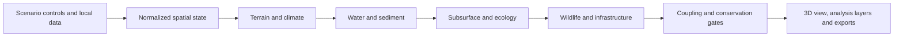

# GeoLab 128

[](https://github.com/laiyukai910-star/geolab-128/actions/workflows/ci.yml)
[](LICENSE)
[](https://github.com/laiyukai910-star/geolab-128/releases)



GeoLab 128 is a local-first 3D laboratory for building regional scenarios and examining how terrain, climate, water, subsurface conditions, ecosystems, wildlife, and infrastructure interact.

> **Project status:** teaching and exploratory prototype. GeoLab 128 exposes model assumptions and conservation checks, but it is not a calibrated forecasting or engineering-decision system.

## Core Goal

The project is designed around one question: when a regional condition changes, which connected systems respond, and why?

Its development priorities are:

1. Keep cross-system relationships explicit and inspectable.
2. Preserve units, provenance, conservation ledgers, and validation results with every scenario.
3. Move deterministic numerical work into a shared Rust core without splitting browser and desktop behavior.
4. Improve scientific validation progressively through reference cases, observed inputs, calibration support, and independent review.
5. Keep the 3D scene readable as an analysis workspace rather than maximizing object density.

## Functional Workspace

| System | Controls and inputs | Main outputs |
| --- | --- | --- |
| Terrain | Regional templates, landform presets, DEM import, elevation editing, relief, uplift, sea level, surface detail | Elevation, slope, aspect, exposure, curvature, roughness, drainage structure |
| Climate and wind | Temperature, humidity, latitude, lapse rate, precipitation, wind speed and direction | Orographic response, rain shadow, local wind exposure, climate class, reference evapotranspiration |
| Hydrology | Soil behavior, routing method, river threshold, water demand, retention and reservoir settings | Filled terrain, D8/MFD/D-infinity flow, contributing area, runoff, recharge, discharge, rivers, watersheds |
| Geomorphology | Erosion strength, sediment behavior, terrain process presets | Stream power, detachment, transport capacity, deposition, sediment export |
| Subsurface | Geological layers, depth, permeability, aquifer and borehole evidence | Soil and rock columns, groundwater storage, water-table estimate, transects, voxel and volume ledgers |
| Ecology | Vegetation, land cover, habitat sensitivity, barriers and ecological block size | Habitat patches, resistance, connectivity, carrying capacity, biodiversity and integrity diagnostics |
| Wildlife | Regional species pool, abundance, migration strength and batch-release conditions | Species suitability, population state, trophic support, movement links and release screening |
| Built environment | Selected placement areas, facility type, density, service demand and adaptation constraints | Suitability, footprints, impervious cover, water demand, heat, retention, ecological and neighboring-block effects |
| Time and hazards | Seasonal state, multi-year horizon, event type and intensity | Vegetation and soil-water progression, flood, drought, wildfire, slope instability, damage and recovery summaries |
| Evidence | DEM, land cover, soil, weather, flowline, facility, borehole and calibration files | Coverage, provenance, resampling history, uncertainty notes and research-readiness checks |

## Scale And Representation

| Property | Supported range |
| --- | --- |
| Study-area side length | 4 km to 512 km |
| Terrain grid | 128 x 128 to 4096 x 4096 samples |
| Elevation control | Up to 10,000 m |
| Ecological blocks | 8 x 8 to 48 x 48 |
| Rust working-layer commit | Up to 512 x 512 |

The terrain raster is not the only spatial representation. GeoLab also maintains river graphs, ecological blocks, infrastructure footprints, local refinement windows, wildlife agents, geological columns, transects, and subsurface volume records. These structures are linked to the same scenario state.

## Model Flow



A scenario update is rebuilt in dependency order. For example, changing terrain can alter wind exposure and precipitation, which can alter runoff, recharge, river extraction, habitat suitability, infrastructure risk, and the resulting 3D scene. Individual process results remain available instead of being reduced to one opaque score.

## Computation

GeoLab uses two cooperating computation paths:

| Component | Responsibility |
| --- | --- |
| Browser engine | Scenario authoring, full working state, local editing, dependent-system rebuilds and interactive analysis |
| `geolab-core` | Typed terrain, routing, water, groundwater, sediment, habitat and process-gate calculations |
| Native service | Loopback-only Rust execution for the Electron application |
| WebAssembly worker | The same Rust core in static-browser mode, off the UI thread |

For grids up to 512 x 512, validated Rust results can replace compatible working layers atomically. Larger grids retain the browser working state and use a bounded Rust audit. A failed gate leaves the existing model unchanged.

Current checks include routing-fraction closure, outlet contributing area, water allocation, managed retention, groundwater storage, sediment accounting, habitat accounting, ecology bounds, and finite-number validation.

## 3D And Analysis Views

The Three.js workspace renders terrain, coastlines, rivers, vegetation, infrastructure, wildlife, wind, hazards, ecological links, selected blocks, and subsurface cutaways. The right-side drawer controls authoring and analysis while the lower-left readout preserves the current regional state.

Procedural objects use type-specific geometry variants and material classes. They are analytical representations, not surveyed meshes, BIM models, CAD assets, or photogrammetry.

The natural-surface view blends rock, soil, vegetation, and sealed ground with multiscale surface relief and wetness-dependent roughness. Materials run locally, remain continuous across terrain tiles, and fade subpixel detail with distance. These are illustrative surface details, not additional DEM samples. [Material comparison and verification](docs/v1-readiness/TERRAIN_MATERIALS.md).

Terrain now has closed sides and a base. Solid, geological-section, and underwater views expose the modeled ground and sea-level water from different positions, with a local sky environment. Underground display exaggeration changes presentation only. [Volume views and their limits](docs/v1-readiness/WORLD_VOLUME.md).

Available analysis layers include elevation, climate, precipitation, temperature, flow accumulation, velocity, shear stress, sediment, erosion, deposition, hazards, vegetation, land cover, soil, groundwater, aquifer potential, imperviousness, wetness, confidence, ecological connectivity, and wildlife richness.

## Data And Exports

Local input support includes GeoTIFF, CSV, JSON, and GeoJSON. Raster adapters retain bounds, units, scale and offset metadata, NoData coverage, fill operations, and resampling methods. Imported evidence remains distinguishable from modeled or gap-filled values.

Scenario outputs include:

- parameters, summaries, quality reports, uncertainty and provenance records;
- grid, river, watershed, ecology, wildlife, infrastructure and subsurface data;
- coupling gates, Rust verification and time-progression reports;
- local refinement, transect, voxel and cube-ledger exports;
- Unity Terrain and Unreal Landscape interchange packages.

Unity packages contain 16-bit RAW heightfields, surface masks, local ENU vectors and import metadata. Unreal packages contain R16 heightfields, R8 masks, scale and origin metadata, and sidecar manifests. These exports are terrain interchange packages, not finished engine scenes.

## Run Locally

### Desktop

Install current Node.js, npm, and the pinned Rust toolchain:

```powershell
cd outputs/geo-sim-desktop
npm ci
npm start
```

The desktop command builds the TypeScript bridge, native Rust service and Rust WebAssembly module before launching Electron. Runtime dependencies are bundled locally.

### Browser

```powershell
cd outputs/geo-sim
python -m http.server 4174 --bind 127.0.0.1
```

Open <http://127.0.0.1:4174/>. Static mode uses the bundled WebAssembly worker. The interface defaults to English and includes Simplified Chinese.

### Rust Service

```powershell
cargo run --release --manifest-path engine/Cargo.toml --package geolab-server -- --port 48129
```

The local API provides versioned health, capability, validation, and simulation endpoints. Its contract is documented in [engine/README.md](engine/README.md).

## Method Boundary

The model structure draws on FAO-56 reference evapotranspiration, NRCS curve-number runoff constraints, Freeman multiple-flow-direction routing, USGS groundwater-reservoir concepts, RUSLE-structured erosion accounting, resistance-based landscape connectivity, UNCCD aridity definitions, and stream-power screening.

These references guide model structure; they do not make an uncalibrated scenario predictive. In particular:

- procedural terrain is not surveyed terrain;
- routing is not a two-dimensional hydraulic solver;
- derived weather forcing is not a station or reanalysis product;
- groundwater, sediment, habitat and hazard modules are screening formulations;
- infrastructure outputs are suitability and impact indicators, not engineering approval.

Real-world decisions require quality-controlled inputs, a scale-appropriate model, calibration and validation data, uncertainty analysis, and qualified domain review.

Method references:

- [FAO Irrigation and Drainage Paper 56](https://www.fao.org/4/X0490E/x0490e00.htm)
- [USDA NRCS direct-runoff handbook](https://directives.nrcs.usda.gov/sites/default/files2/1754923466/Subpart%20H%20%E2%80%93%20Estimation%20of%20Direct%20Runoff%20from%20Storm%20Rainfall.pdf)
- [Freeman multiple-flow-direction formulation](https://doi.org/10.1016/0098-3004(91)90048-I)
- [USGS PRMS groundwater reservoir](https://pubs.usgs.gov/of/2002/ofr02362/htdocs/gwflow/gwflow_prms_min.htm)
- [USDA RUSLE2 process documentation](https://www.ars.usda.gov/southeast-area/oxford-ms/national-sedimentation-laboratory/watershed-physical-processes-research/research/rusle2/revised-universal-soil-loss-equation-2-how-rusle2-computes-rill-and-interrill-erosion/)
- [Resistance-based landscape connectivity](https://doi.org/10.1111/j.0014-3820.2006.tb00500.x)

## Repository Map

| Path | Contents |
| --- | --- |
| `engine/geolab-core/` | Shared Rust model library |
| `engine/geolab-server/` | Local Axum service |
| `engine/geolab-wasm/` | Browser WebAssembly interface |
| `outputs/geo-sim/` | Browser application, Three.js renderer, data adapters and exports |
| `outputs/geo-sim/src-ts/` | Reviewed TypeScript computation and transport boundaries |
| `outputs/geo-sim-desktop/` | Electron runtime and local build orchestration |
| `outputs/geo-sim/tests/` | Deterministic browser, model, ecology and interoperability tests |

See [CONTRIBUTING.md](CONTRIBUTING.md) for development and contribution guidance. Releases are recorded in [CHANGELOG.md](CHANGELOG.md). Licensed under the [MIT License](LICENSE).
