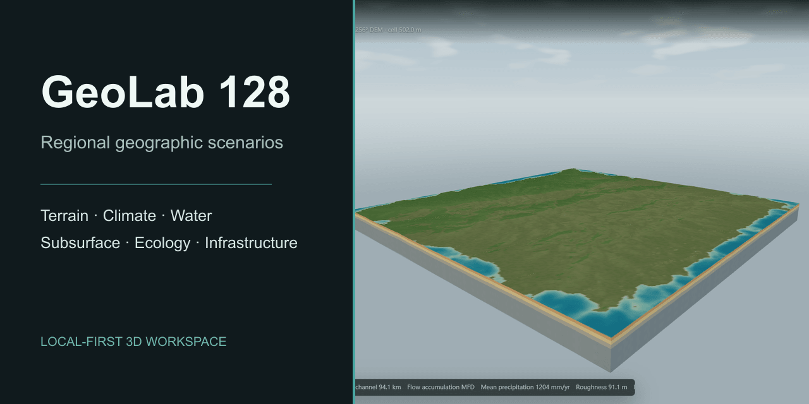

# GeoLab 128

[](https://github.com/laiyukai910-star/geolab-128/actions/workflows/ci.yml)
[](LICENSE)
[](https://github.com/laiyukai910-star/geolab-128/releases)



GeoLab 128 is a local-first 3D workspace for composing regional geographic scenarios. It keeps terrain, climate, water, subsurface conditions, ecosystems, wildlife, and infrastructure in one inspectable model.

## What It Does

- Build regions from continental templates, elevation controls, imported raster evidence, and local edits.
- Trace the effect of changing relief, sea level, temperature, precipitation, wind, soil, or land cover through routing, runoff, recharge, sediment, habitat, and infrastructure indicators.
- Inspect terrain as a solid landscape, geological section, underwater scene, or adjustable karst-cave scenario.
- Work with regional grids from 128 x 128 to 4096 x 4096 samples across 4 km to 512 km study areas, with elevation controls up to 10,000 m.
- Place infrastructure in selected areas with site constraints and neighboring-block effects.
- Screen freshwater and marine habitat separately by medium, depth, salinity assumptions, disturbance, and water-connected block links.
- View locally generated anatomy for 13 organism forms, including fish, ray, octopus, jellyfish, crab, mussel, bat, fern, fungus, coral, and kelp.
- Export terrain interchange packages for Unity Terrain and Unreal Landscape.

## Workspace

| Area | Main controls | Inspectable outputs |
| --- | --- | --- |
| Terrain and climate | Templates, DEM input, elevation, sea level, temperature, humidity, precipitation, wind | Elevation, slope, aspect, roughness, exposure, climate and evapotranspiration |
| Water and landform | Soil behavior, routing, retention, erosion, sediment | Flow paths, watersheds, runoff, recharge, discharge, erosion, deposition |
| Underground and coast | Layer depth, geological evidence, section position, cave dimensions | Columns, groundwater indicators, cutaways, seabed, sea surface |
| Ecology and wildlife | Vegetation, block size, barriers, species, releases | Habitat, resistance, connectivity, carrying-capacity indicators, movement links |
| Built environment | Selected placement areas, facility type, density, demand, adaptation | Suitability, footprints, impervious cover, water demand, heat and risk indicators |
| Evidence and export | GeoTIFF, CSV, JSON, GeoJSON, scenario export | Provenance, coverage, quality reports, Unity and Unreal terrain packages |

The renderer is an analysis view rather than a separate scene format: terrain tiles, river graphs, ecological blocks, infrastructure footprints, wildlife agents, geological columns, transects, and volume records point to the same scenario state.

## Local Runtime

### Desktop

```powershell
cd outputs/geo-sim-desktop
npm ci
npm start
```

The desktop runtime starts a loopback-only Rust service and the Electron workspace. Browser assets, Three.js, and WebAssembly modules are bundled locally.

### Browser

```powershell
cd outputs/geo-sim
python -m http.server 4174 --bind 127.0.0.1
```

Open <http://127.0.0.1:4174/>. Static mode uses the bundled WebAssembly worker. The UI defaults to English and includes Simplified Chinese.

## Architecture

```text
scenario controls and local evidence
            |
terrain and climate -> routing, water and sediment -> subsurface and ecology
            |                                              |
            +---------------- wildlife and infrastructure -+
                                                           |
                                             checks, analysis views and exports
```

`engine/geolab-core` contains typed Rust calculations used by the native service and WebAssembly worker. The browser owns interaction and rendering; compatible working layers can be replaced atomically by validated Rust results. A failed process gate leaves the existing scenario state intact.

Water-connected habitat uses a Rust raster kernel up to 4096 x 4096 cells. It reads binary elevation and river arrays inside the model Worker, identifying boundary-connected seawater and river nodes for ecological blocks and wildlife placement. TypeScript defines the habitat contracts and provides a diagnosed fallback when the kernel is unavailable.

## Scientific Scope

GeoLab makes its assumptions visible and keeps imported evidence distinct from modeled fields. Its structure draws on established hydrology, geomorphology, groundwater, and connectivity formulations, including FAO-56 reference evapotranspiration, NRCS runoff constraints, multiple-flow-direction routing, groundwater-reservoir concepts, RUSLE-structured erosion accounting, and resistance-based landscape connectivity.

It is not a calibrated forecast, a hydraulic CFD model, a geological survey, a species-distribution model, or an engineering approval tool. Procedural terrain, organisms, caves, and materials are visual representations; cave geometry does not modify groundwater conductance or storage. Real-world decisions require quality-controlled inputs, a scale-appropriate model, calibration and validation data, uncertainty analysis, and domain review.

Detailed method boundaries and checked behavior:

- [Terrain materials](docs/v1-readiness/TERRAIN_MATERIALS.md)
- [Terrain, water, and underground views](docs/v1-readiness/WORLD_VOLUME.md)
- [Organisms, aquatic habitat, and cave controls](docs/v1-readiness/BIOMES_AND_CAVES.md)
- [Asset construction notes](docs/v1-readiness/ASSET_REBUILD.md)

## Repository Map

| Path | Contents |
| --- | --- |
| `engine/geolab-core/` | Shared Rust model library |
| `engine/geolab-server/` | Loopback-only native service |
| `engine/geolab-wasm/` | WebAssembly interface |
| `outputs/geo-sim/` | Browser workspace, renderer, adapters, and exports |
| `outputs/geo-sim/src-ts/` | TypeScript computation and transport boundaries |
| `outputs/geo-sim-desktop/` | Electron runtime and local build orchestration |
| `outputs/geo-sim/tests/` | Deterministic model, renderer, ecology, and interoperability tests |

See [CONTRIBUTING.md](CONTRIBUTING.md) for contribution guidance, [CHANGELOG.md](CHANGELOG.md) for release history, and [LICENSE](LICENSE) for licensing.
