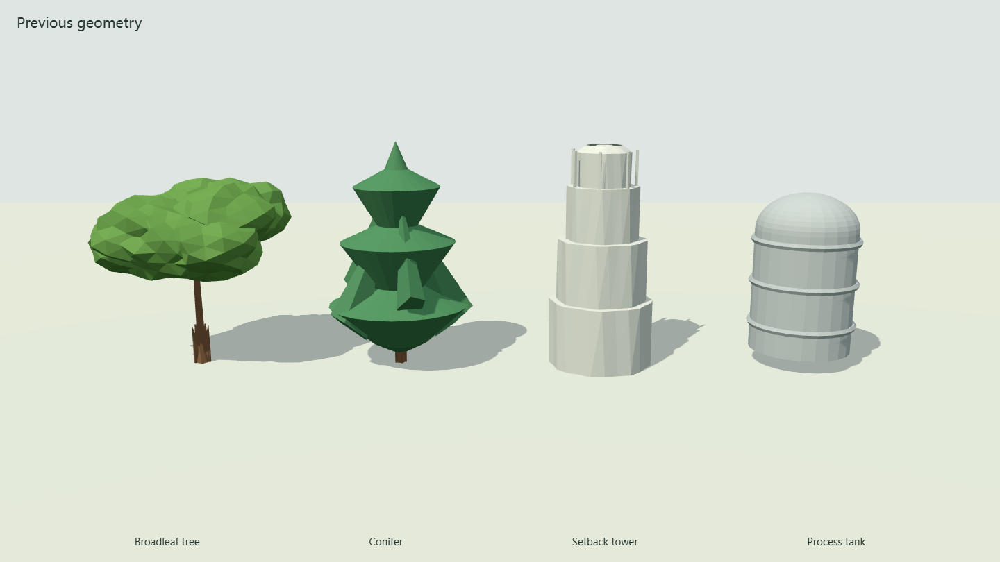
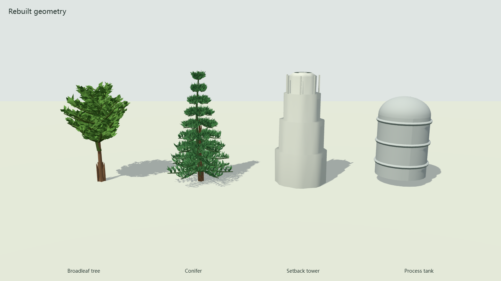

# Procedural Asset Rebuild: First Stage

This stage changes rendering geometry and foliage selection. It does not change
terrain elevation, ecological abundance, canopy-height inputs, or geographic
process equations. The following local captures use identical camera, lighting,
quality (`ultra`), instance dimensions, and colors.

## Before

## After

The isolated comparison scene uses the same asset constructors and instanced
foliage implementation as the application. It is a model inspection fixture,
not a simulated forest or surveyed building scene.

| Change | Result |
| --- | --- |
| Assembly buffers | Preserve indices, UVs, and optional vertex colors; keep source hard-edge splits |
| Curved surfaces | Reconstruct smooth normals after deformation instead of flattening every merged triangle |
| Broadleaf crown, ultra | 451 branch segments and 2,520 folded leaves per template |
| Conifer crown, ultra | 946 branch segments and 7,938 needle-like leaf blades per template |
| Crown material | Opaque, double-sided foliage; no transparent enclosing shell |
| Distance selection | Shared distant mesh below a 16-pixel projected size; at most 128 detailed instances per variant batch |

At equal triangle counts, the example storage tank uses 923 vertices instead of
4,104; the tower uses 532 instead of 1,692. Detailed crowns intentionally contain
more geometry. These counts are not claims of faster overall application startup.

A same-machine browser check recorded approximately 5.79 s startup / 11.84 s
rebuild for the new renderer, versus 5.08 s / 10.48 s when serving the previous
renderer and asset modules. These single observations indicate additional
rendering cost; they do not establish a general performance ratio.

## Verification

- New geometry regression failed on the original unindexed storage-tank assembly.
- All registered asset kinds generate finite high-quality positions and valid indices.
- Foliage checks cover deterministic variants, bounded geometry, unit normals,
  per-vertex colors, and increasing detail between quality profiles.
- Distance selection preserves instance totals and enforces the close-detail cap.
- Browser comparison checks pass for canvas pixels, orbit interaction, and
  1440 x 810 / 390 x 844 viewports, with no recorded shader or page errors.
- Static application startup and temperature rebuild pass with WASM authority
  and 13 process gates. The unchanged modeled temperature values match the baseline.

Buildings, wildlife anatomy, terrain materials, and additional plant forms are
not rebuilt in this stage. Botanical structures remain procedural visual forms,
not calibrated species architecture or biomass measurements.
