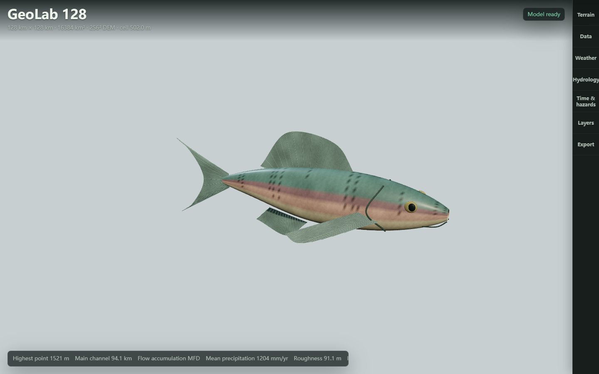
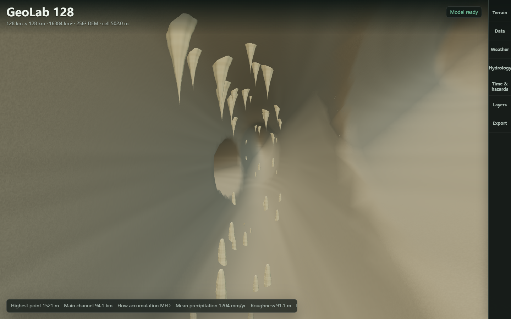

# Organisms, Aquatic Habitat And Caves

## Workspace

Open the **Layers** drawer. **Organism anatomy** selects a model; **Inspect specimen**
opens it in the existing 3D canvas. Orbit and zoom remain available. **Return to
terrain** restores the regional view. These controls do not rebuild the science
model, and the lower-left regional readout remains unchanged.

| Model family | Modeled features | Integration |
| --- | --- | --- |
| Trout, perch, reef fish forms | Profiled body, curved rayed fins, gills, mouth, eyes, surface pattern | Aquatic population and release profiles |
| Ray | Pectoral disk, tapering tail, eyes, ventral gills | Marine benthic profile |
| Octopus | Mantle, eight curved arms, paired sucker rows, eyes | Marine benthic profile |
| Jellyfish | Bell, marginal tentacles, oral arms | Marine profile |
| Crab and mussel | Carapace, articulated limbs and claws; ridged paired shells and siphon | Marine crab and freshwater mussel profiles |
| Bat and fungus | Wing membranes and bones; cap, stem and gills | Cave exemplars and specimen view |
| Fern, branching coral and kelp | Stems, leaflets, branching growth and blades | Specimen view; coral/kelp at screened marine sites |

All geometry is generated locally with indexed surfaces and shared materials.
Fish flexion, arm motion, bell pulsation, and plant sway run in vertex shaders.
These are recognizable procedural forms, not scanned specimens or validated
species anatomy. The new detailed forms do not replace every existing terrestrial
animal or facility model.



## Water Habitat Rules

1. Submerged cells connected to the map boundary through four-neighbor submerged
   cells are treated as marine. An isolated low depression is not sufficient
   evidence for either seawater or a freshwater lake.
2. Freshwater sites require an above-sea river node with positive hydraulic
   width and more than 0.08 m of modeled depth.
3. Profiles require the matching medium, their configured salinity envelope and
   depth range. Temperature provides a soft suitability factor. Disturbance and
   impervious cover reduce suitability.
4. Marine habitat area uses submerged cell area; river habitat area uses cell
   area multiplied by the channel-width/cell-width fraction, capped at one.
5. Agents use compatible sampled water sites. Their display dimensions fit the
   local water column and channel width. They flex in place instead of following
   a decorative orbit across land.
6. Cross-block aquatic links require adjacent marine cells or a wet river segment
   crossing the boundary. Adult mussels have no active migration links.

Each block retains at most 32 representative sites per medium. This is a coarse
screen, not a navigable channel mesh or proof of continuous within-block passage.
It does not resolve estuarine mixing, tides, water temperature, dissolved oxygen,
substrate, life stages, seasonal migration, or larval dispersal. Sea salinity is
assumed to be 35 PSU by default and river salinity 0.3 PSU. The temperature input
is an air-temperature proxy, not a water-energy balance. Profile abundance,
growth, density, and temperature envelopes are uncalibrated scenario constants.

The names describe functional morphotypes, not species distribution models.
For example, the resident freshwater trout form does not model anadromous
steelhead life histories. [NOAA steelhead account](https://www.fisheries.noaa.gov/species/steelhead).

Coral and kelp are visual habitat assemblies, not new carbon or population pools.
They require marine connection, shallow depth, assumed marine salinity, low
impervious cover, and a warm/cool temperature proxy screen. Geometry is created
only near an immersed camera, with at most 48 instances of each form. A dry or
incompatible region receives none. This is intentionally narrower than the
diversity of real marine habitats: photosymbiotic reef corals depend on suitable
light and water conditions, while deep-water corals are different systems.
[NOAA coral-water requirements](https://oceanservice.noaa.gov/facts/coralwaters.html).

The kelp form has a holdfast, flexible stipes, gas bladders and undulating blades,
distinct from the fern mesh. Kelp are brown algae, not terrestrial plants; the
gas-bladder architecture is an illustrative giant-kelp-like form, not a trait of
every kelp species. [NOAA kelp structure](https://sanctuaries.noaa.gov/visit/ecosystems/kelpdesc.html).

## Cave Scenario

Choose **Volume view > Karst cave scenario**. Controls set passage length
(80-800 m), chamber radius (3-25 m), and center burial depth (20-190 m).
Geometry shrinks when the selected map extent or modeled depth cannot contain
the requested dimensions. Entering this view sets underground exaggeration to
one; the ordinary terrain vertical scale still applies.

Five connected passage segments define one signed-distance field. The same
field is used for Marching Cubes extraction, the section opening, and camera
access, including closed branch endpoints. Interior rock shading, irregular
speleothems, a bat and detrital fungi provide inspectable structure. Inspection
lighting is deliberate display illumination, not natural underground light.



Real karst depends on soluble rock and connected fractures and conduits. GeoLab's
current generic subsurface classes do not establish a carbonate formation or
surveyed void network. The cave is therefore an explicit teaching scenario,
not an automatic inference of karst occurrence. It adds no dissolution rate,
conduit flow, collapse prediction, groundwater storage, or hydraulic conductance.
[USGS karst aquifers](https://www.usgs.gov/mission-areas/water-resources/science/karst-aquifers).

Dark cave zones do not support photosynthetic vegetation. The scene uses only
bat and detrital-fungus exemplars there; it does not simulate their food supply,
guano, cave microclimate, or population. [NPS cave biology](https://www.nps.gov/ozar/learn/education/cave-biology.htm).

## Representation And Verification

Underground natural-view colors use cubic B-spline reconstruction and a 92%
blend toward a regional per-layer tone. This removes the coarse colored-tile
presentation, but must not be read as evidence of continuous lithology. Raw
categorical columns and analysis layers are unchanged. Rock grain and bedding
are filtered display texture, not new measurements.

River ribbons follow existing routed endpoints, interpolate hydraulic widths
and depths, and resample the triangular terrain along curved display paths.
At a 128 km overview, meter-wide channels may be subpixel. No channel incision,
surveyed cross-section, or additional hydraulic solver is implied.

Regression checks cover deterministic finite organism geometry, closed cavity
edges, shared field agreement, shallow-depth bounds, color continuity, water
screening, constrained releases, aquatic block links, deferred benthos, resource
disposal, and unchanged scientific arrays. Run from the repository root:

```sh
node outputs/geo-sim/tests/aquaticHabitats.test.mjs
node outputs/geo-sim/tests/biomeGeometry.test.mjs
node outputs/geo-sim/tests/terrainVolume.test.mjs
```

Local verification on 2026-09-06/07 also exercised all 13 specimens at 1440 x
900, the specimen viewer at 390 x 844, cave orbiting, and cave-to-underwater
transitions. Canvas checks found visible model pixels and no recorded shader
or page errors. The existing sky/underground fixture passed rotation,
translation, clipping-distance, underside, and camera-penetration regressions.
The synchronized Windows folder application passed its Electron smoke test,
with native Rust authority, all 13 process gates, and zero external requests.
These engineering tests do not establish ecological or geological calibration.

The new models and cave are renderer features. Existing Rust numerical authority
and Unity/Unreal terrain interchange remain unchanged; these additions are not
exported as complete engine-ready scenes.
