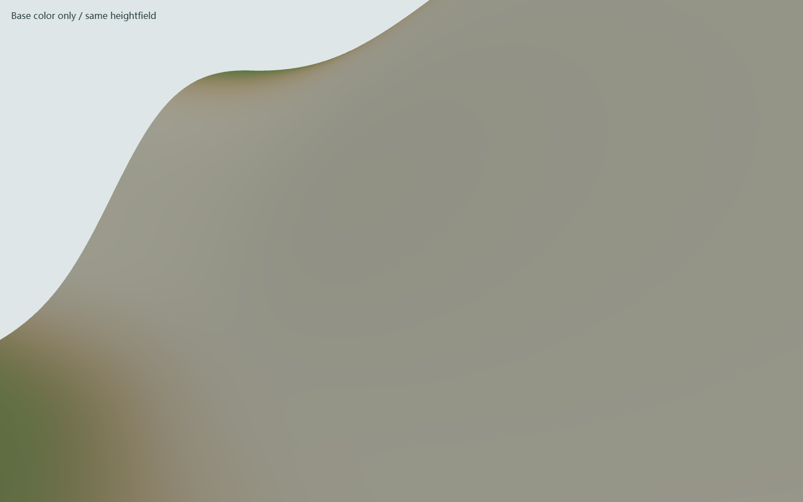
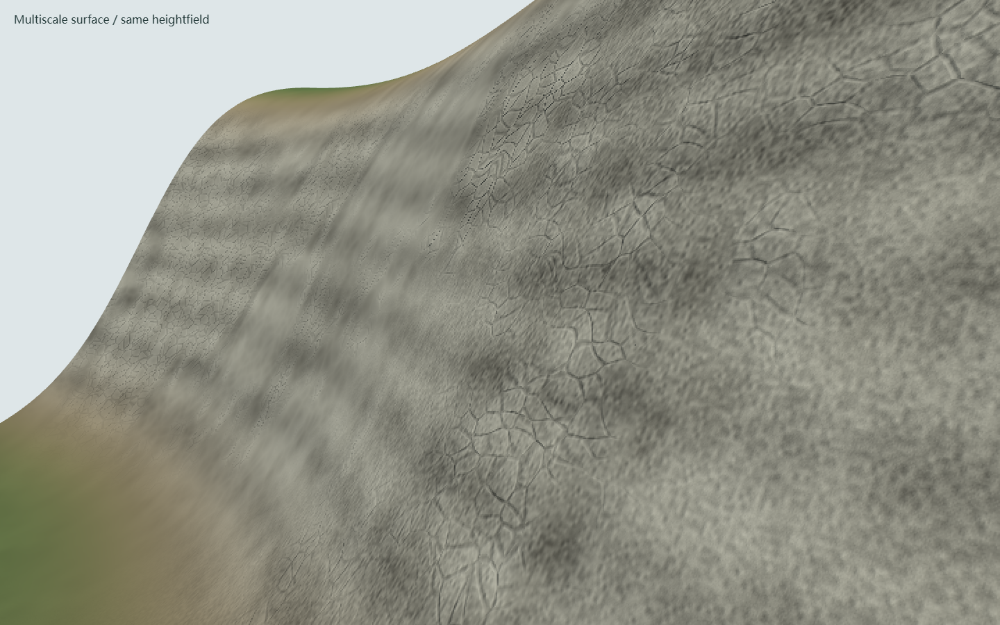

# Terrain Surface Materials

The natural-surface view uses the existing heightfield and a separate procedural
material layer. Elevation, flow routing, soil parameters, ecological inputs, and
process-gate results are unchanged.

## Surface Layers

| Layer | Rendering behavior |
| --- | --- |
| Exposed mineral | Warped cellular joints, interrupted fractures, strata, chips, and granular relief |
| Soil | Multiscale grain, diffuse variation, and roughness |
| Vegetation cover | Broad patches with finer ground-cover mottling |
| Sealed ground | Attenuates natural relief and vegetation tones |
| Wetness proxy | Darkens the base color and reduces roughness |

Rock exposure is a visual slope/cover heuristic, not a lithology inference.
Wetness uses the existing topographic wetness index; it is not measured surface
water or soil moisture. The system does not invent snow cover, mapped fractures,
or additional terrain elevations.

Patterns use continuous three-dimensional local coordinates in metres, before
vertical exaggeration. Their nominal scales range from 160 m patches to 4.5 cm
grit. These scales describe synthesized patterns, not measurement accuracy.
Pixel-footprint filtering suppresses detail that cannot be resolved on screen.
Relief modifies shading normals only; silhouettes, collision surfaces, and
scientific raster resolution remain unchanged.

## Close Comparison

Both captures use the same synthetic 160 m inspection patch, 257 x 257 height
samples, camera, lighting, base colors, and tile geometry. This patch is a
rendering fixture, not a surveyed location or a new selectable simulation extent.

Base color only:

Procedural surface enabled:

The fixture is stored at
[`outputs/geo-sim/tests/fixtures/terrain-material.html`](../../outputs/geo-sim/tests/fixtures/terrain-material.html).
Serve the browser application and open `/tests/fixtures/terrain-material.html`.
Use `?version=before&shot=close` and `?version=after&shot=close` to compare the
same camera. Omit `shot=close` for the overview. Orbit interaction is available.

## Integration And Checks

- Natural surface is the default view; elevation and other analytical palettes
  retain their original color values without procedural roughness or relief.
- Global heightfield differences provide matching normals on shared tile edges.
- Local height edits also refresh adjacent-tile normals and geometry bounds.
- Material weights require four bytes per render vertex. No additional terrain
  triangles, remote textures, or new runtime dependencies are introduced.
- The terrain regression covers bounded weights, deterministic colors,
  unmodified scientific arrays, analytical colors, shared normals, adjacent-tile
  dirty updates, and updated culling bounds. It is included in CI.
- Local Chrome/Playwright captures passed pixel and orbit checks at
  1440 x 900 and 390 x 844, with no recorded shader or page errors.
- The static application passed offline startup, real drawer-based layer
  switching, and a temperature rebuild through the browser WASM runtime.
  All 13 process gates passed; mean temperature changed from approximately
  12.962 C to 14.462 C when the input increased by 1.5 C.

This stage improves surface appearance, not photogrammetric fidelity. Dedicated
snow, sand, exposed lithologies, eroded cliff silhouettes, and calibrated material
response remain separate work. The shader is specific to the Three.js workspace;
Unity/Unreal exports continue to use their existing heightfields and masks.
