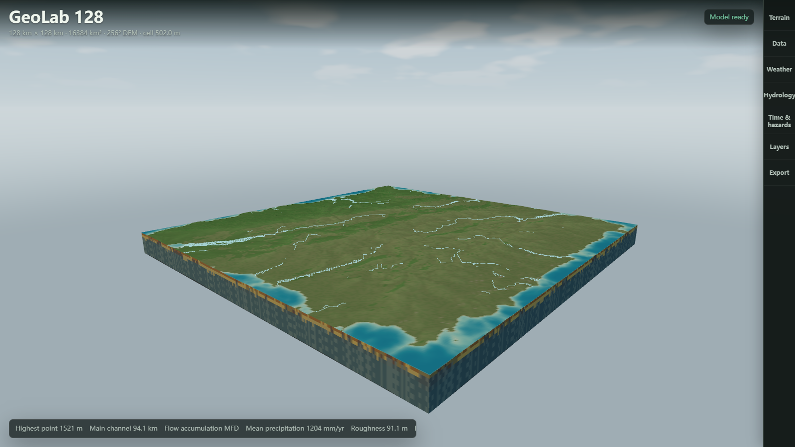
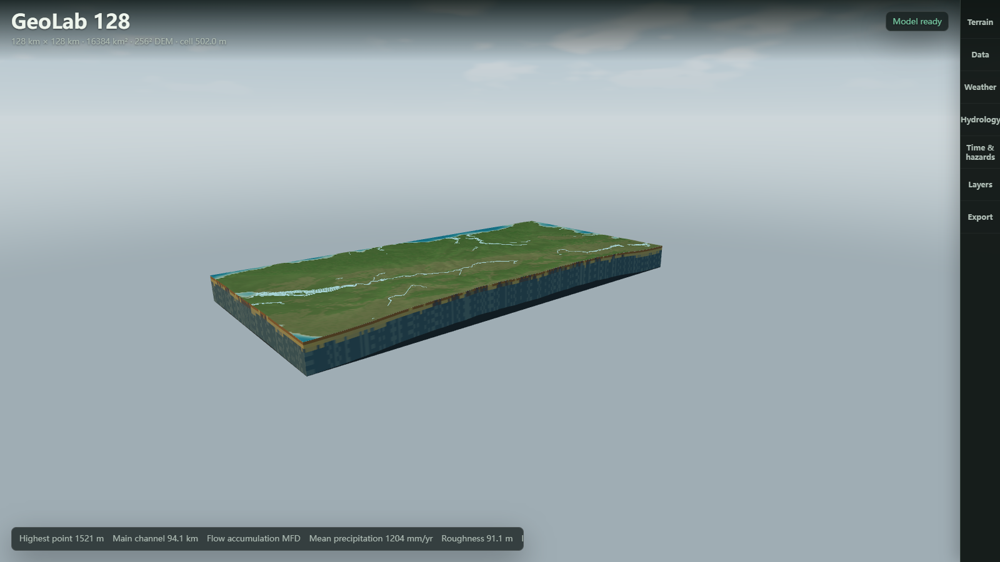
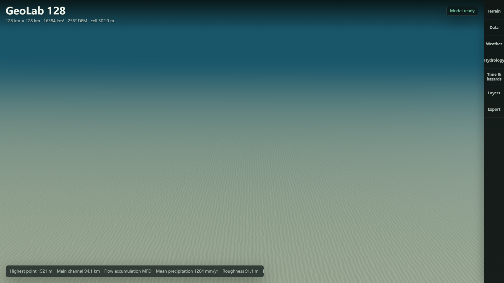

# Terrain, Water And Underground Views

## Solid Terrain

The rendered terrain now forms a closed boundary: the existing heightfield,
elevation-following perimeter walls, and a bottom surface. Walls sample the
existing subsurface columns for lithology and groundwater-saturation colors.
Extensions beneath modeled columns use an unclassified base color; they are
geometric closure, not additional geological evidence.

## Geological Section

The Layers drawer provides a Volume view selector. Geological section removes
the part of the region beyond a movable grid-aligned plane and closes the exposed
face. Terrain, vegetation, infrastructure, wildlife, river lines, and diagnostic
objects share the same clipping plane. Selecting an underground analysis layer
also opens the section view.

Section position ranges from 5% to 95% of the east-west extent. Underground
exaggeration defaults to 20 and can be set to 1 for the same vertical factor as
the terrain. This is an additional display multiplier on depth below the local
surface, not a change to geological thickness, hydraulic pressure, storage,
or any exported depth values. The ordinary terrain vertical scale still applies.
At a regional extent, actual shallow geological layers otherwise occupy only a
few screen pixels.

Clipping follows Three.js world-space material planes. The renderer enables
local clipping and excludes the removed side from double-click terrain focus.
See the [Three.js material clipping contract](https://threejs.org/docs/pages/Material.html#clippingPlanes).

## Water And Sky

Sea surfaces reuse the terrain geometry buffers, project vertices to the selected
sea level, and discard land fragments. Shoreline intersections therefore follow
the same triangular heightfield as the ground. Boundary faces extend to the
modeled seabed and remain visible at the section face.

Underwater view places the camera over submerged terrain. Seabed grain, surface
ripples, water color, transparency, and fog provide depth cues. Entering and
leaving water changes the optical environment automatically. A dry scenario
reports that no submerged terrain is available rather than inventing water.

The sky dome contains a sun glow, horizon tones, and slowly moving procedural
clouds. It requires no downloaded textures. Sky and sea display can be switched
off independently. Water is hidden on analytical surface palettes so it does
not conceal their colors.

These are display systems, not a calibrated atmosphere, wave spectrum, or 3D
fluid solver. River centerlines remain the existing river representation; this
stage does not add surveyed channel bathymetry. The terrain top is still a
heightfield: caves, overhangs, and fully volumetric geological mechanics are
not implemented by closing its boundary.

## Verification

Local checks performed on 2026-09-06:

- The volume regression verifies that every nondegenerate boundary edge belongs
  to two triangles after combining the top, sides, cut face, and bottom.
- Tests cover section extents, sea-boundary geometry, interpolated terrain height,
  immersion transitions, clipping removal, and unchanged scientific arrays.
- Resource tests verify that disposing water does not release borrowed terrain
  geometry and that scene-owned geometry/materials are removed.
- Playwright exercised all three views at 1600 x 900 and 390 x 844, with canvas
  pixel checks, orbit interaction, and no recorded shader/page errors.
- Switching volume views did not start another scientific model computation.
- Browser WASM startup and a temperature rebuild passed all 13 process gates.
- A fresh Windows folder build passed its packaged Electron smoke test using the
  native Rust sidecar, including 13 process gates, canvas pixels, geometry audit,
  and zero external requests.

The new local executable is under
`outputs/GeoLab-128-Local/GeoLab 128-win32-x64/GeoLab 128.exe`.
Historical self-extracting portable executables were not rebuilt in this stage.
The heightfield/Unity/Unreal data exports are unchanged; these new renderer
materials and clipping controls are not exported as engine-ready scenes.
